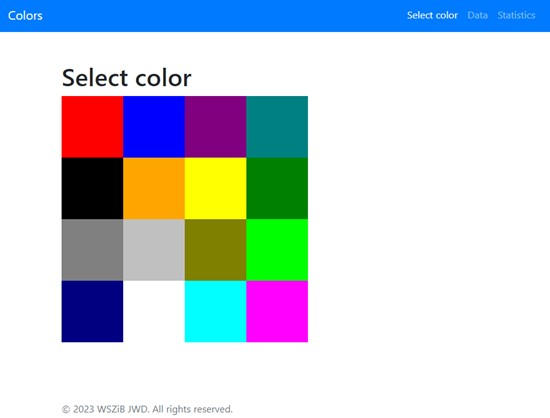
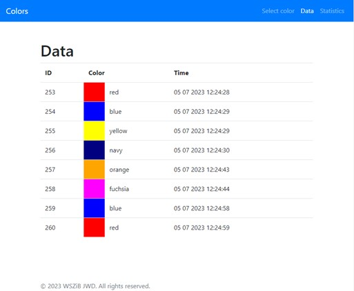
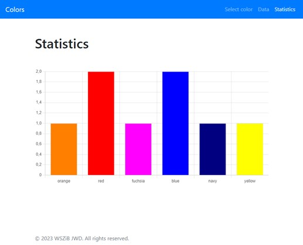

# colors
 
The application can be used to study color preferences of anonymous users. The application consists of three views: color selection, detailed data and general statistics. The user selects a color from a panel presented on the main page. The data view contains  details of individual choices with the time of selection. The last tab Statistics presents the results in the form of a chart. Colors uses a database to save selection results.  
 

### Technology stack: 
* Java
* Maven
* Spring Boot (Web, JPA)
* SQL Server, PostgreSQL
* Thymeleaf
* Chart.js

### Select view

### Data view

### Statisctisc view

